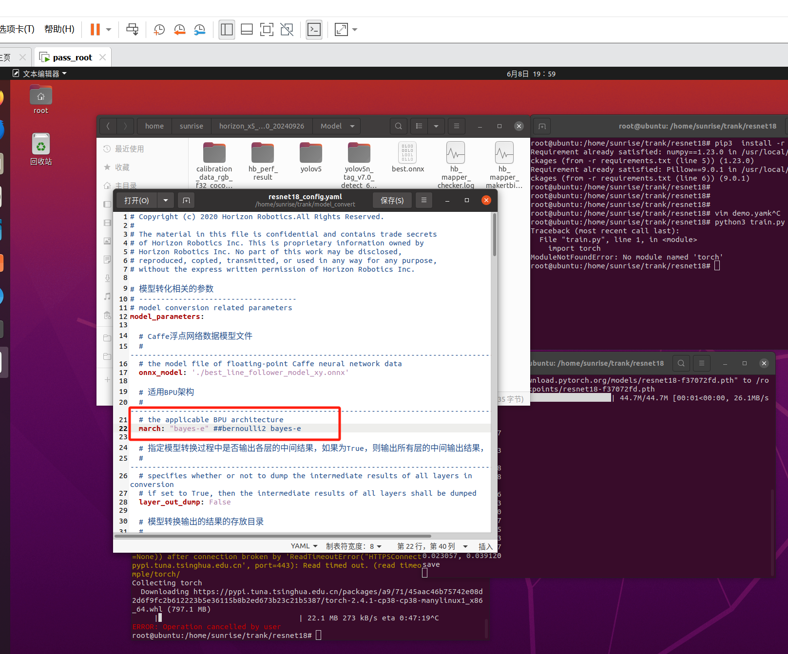

# 巡线模型训练

## 前期准备环境

### 使用地瓜算法工具链Docker镜像，选择CPU或GPU

```shell
# Ubuntu20.04 CPU Docker镜像（仅提供运行环境，请配合OE开发包使用）：
wget -c ftp://x5ftp@vrftp.horizon.ai/OpenExplorer/v1.2.8_release/docker_openexplorer_ubuntu_20_x5_cpu_v1.2.8.tar.gz --ftp-password=x5ftp@123$%
#Ubuntu20.04 GPU Docker镜像（仅提供运行环境，请配合OE开发包使用）：
wget -c ftp://x5ftp@vrftp.horizon.ai/OpenExplorer/v1.2.8_release/docker_openexplorer_ubuntu_20_x5_gpu_v1.2.8.tar.gz --ftp-password=x5ftp@123$%
```

### 进入Docker镜像 ，根据自己的实际环境去选择，可以去找个Docker帖子跟一下。

```shell
docker run -it -v /home/sunrise:/open_explorer openexplorer/ai_toolchain_ubuntu_20_x5_cpu:v1.2.8-py310
```

### 把track_image文件夹放进同级目录


## 数据集转化

```shell
#脚本支持设置数据集的读取位置以及转换之后数据集的存放位置 
python3 labelme2resnet.py
```

转化成功之后，在同级目录下会生成line_follow_dataset文件夹，存放转换后的数据集，文件结构如下

```shell
root@root-vpc:~/line_follow_dataset$ tree -L 2 
├── test 
│   ├── image 
│   └── label 
└── train  
    ├── image     
    └── label
```

## 训练

进入resnet18目录，运行训练脚本

```shell
#安装相关功能包,镜像里面都有，可以不用安装
cd resnet18 
pip install -r requirements.txt  

#训练 
python3 train.py
```

训练开始之后会输出训练损失和测试损失，当测试损失有所下降时将保存当前的模型


##  模型转化


```shell
在进行模型量化前需要将模型格式转换为onnx格式
#转化 
python3 export.py
```

转换成功后会在相同的路径下生成onnx格式的模型


## 模型量化

取数据集中的100张图片放到文件夹model_convert/dataset/image文件夹下，将生成的onnx模型存放到model_convert下


### 准备校准文件

```shell
cd model_convert  

#运行图片转换脚本
python3 generate_calibration_data.py --dataset ./dataset -o ./calibration_data
```

运行成功之后会生成calibration_data文件夹

### 模型编译

**注意：在resnet18_config.yaml。march字段中，如果你是X5的主板你就写 "bayes-e"  X3的写 bernoulli2**




```shell
#编译模型 
hb_mapper makertbin --config resnet18_config.yaml --model-type onnx
```

编译成功后，会在model_output/model_output路径下生成最终的模型文件


